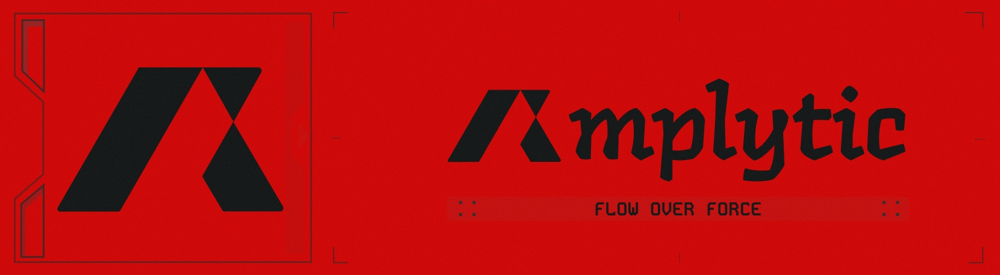
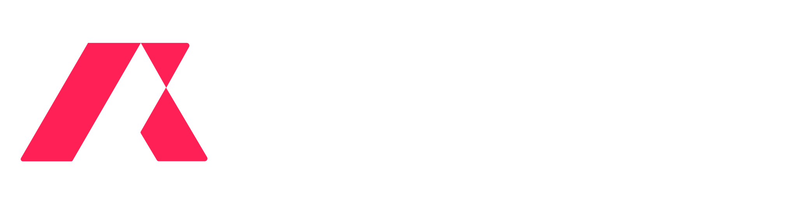

# **Amplytic**
### **Beyond Visuals. Built with Vision.**

---

### **Who We Are**
Amplytic is a **developer-led studio** building high-end systems and digital experiences. We bridge the gap between bespoke engineering and strategic design to help forward-thinking brands amplify their presence.

### **Our Expertise**
- 🛠️ **Software Engineering**: Building scalable, robust systems from the ground up.
- 🎨 **Strategic Design**: Creating intentional, clear, and high-impact visual identities.
- 🚀 **Digital Products**: Transforming complex visions into high-performance web and mobile applications.

---

### **✨ Open Source @ Amplytic**
We believe in giving back to the community. We are actively developing and publishing **open-source tools** designed to improve the developer experience and streamline modern workflows.

> [!TIP]
> Keep an eye on our repositories for upcoming tools and libraries that solve real-world development challenges.

---

  

